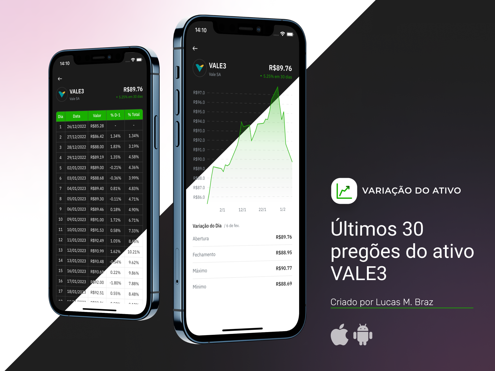
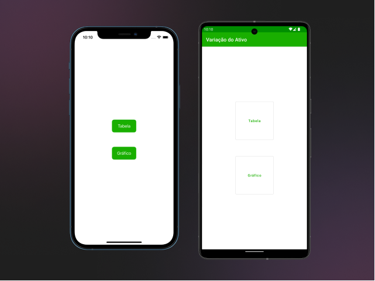
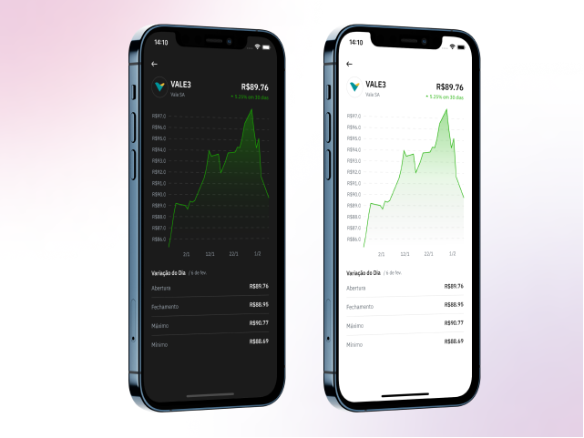

## Introduction

This app shows how the stock price of VALE3 has evolved over the last 30 trading days. Users can view the data in two ways:
Table: presents the open price for each day as well as the comparison with the previous day and the first day on the list. 
Chart: a line chart that makes it easy to view how the price has changed.

## Supported Platforms

The app is available on Android and iOS devices. The main features were developed using Dart/Flutter, which means the same code is shared between the two platforms.

There's however a screen that allows users to choose how they want to visualise the data. This screen (shown below) was implemented natively on each platform. 

The goal of this project is to show how Flutter can be integrated into existing mobile apps. 



#### Project Structure

The project is organized in the following folders:

```
/project/root
└── android_stockpricechange/         <--- Android App
└── flutter_module_stockpricechange   <--- Flutter Module (shared)
└── ios_stockpricechange              <--- iOS App
```

## Running the app

The following script can be used to open the Android and iOS apps on their corresponding IDEs:

```bash
  #!/bin/bash
  cd flutter_module_stockpricechange/
  flutter pub get

  # For Android builds:
  open -a "Android Studio" ../android_stockpricechange # macOS only
  # Or open the ../android_stockpricechange folder in Android Studio for other platforms.

  # For iOS builds:
  cd ../ios_stockpricechange
  pod install
  open stockpricechange.xcworkspace
```

### Flutter <> Native Communication

The communication between the host platform and *Flutter* was implemented using [pigeon](https://pub.dev/packages/pigeon). 

When the user chooses one of the options on the first screen (table or chart), the host platform sends a message with the selection to Flutter before showing the Flutter module. 

Later, when the user presses back to return to the first screen, Flutter sends a message to the host platform, which in turn takes care of navigation.

## Design System

The app uses a dedicated module for the design system. Some advantages of using this pattern are the consistency across the entire app, as well as the easy implementation of dark mode. 



## Testing

There are two sample automated tests in the project: unit tests for the *reducer* verifies the business rules; widget tests for `StockInfo` show how to check that the UI presents the desired information. 

Ideally, there would be many more of these tests, but they serve to show how this project could evolve. 

## Demo

